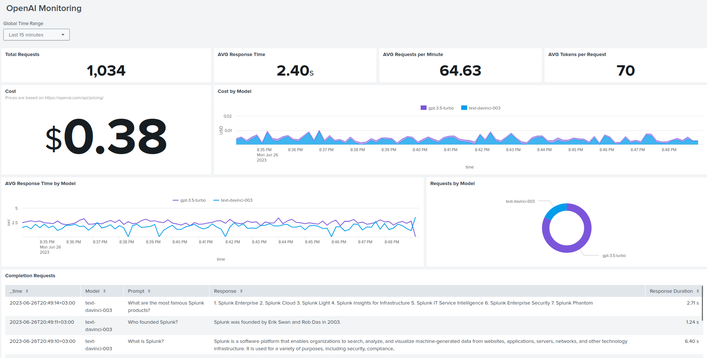

# OpenAI API Usage Monitoring with Splunk

## Configuration

To get started, follow these steps:

1. Create an index named `open_ai` in your Splunk instance.
2. Set up Splunk's HTTP Event Collector (HEC) and configure it to use the `open_ai` index with a `_json` sourcetype.
3. Set the following environmental variables:
   - `SPLUNK_HEC_URL` (e.g., https://localhost:8088/services/collector)
   - `SPLUNK_HEC_TOKEN`
   - `OPENAI_API_KEY`
4. Install the necessary libraries by running the command: `pip3 install openai requests`.
5. Add the `openai_splunk_monitor.py` file to your project and import the `init_monitor()` function from it.
Refer to the provided `example.py` for guidance.

## Cost Calculation
The calculation of the funds spent is performed in Splunk. For that create a lookup based on the attached `openai_prices.csv`
and name it `openai_prices`.
You can change the price values if they are updated. Prices are based on https://openai.com/pricing.

## Dashboard
Create a new dashboard in Dashboard Studio and add the code from `dashboard.json`.

## Monkey Patching
Monkey patching is a technique utilized to alter the behavior of the `Completion` call dynamically during runtime.
This modification allows for the capture of response and metrics, which can then be sent to Splunk.

## License
The `openai-splunk-monitoring` project is governed by the MIT License. 
Additionally, it includes source code from external libraries. 
For a comprehensive list of these libraries and the corresponding licensing terms, please refer to the third-party notices document.
